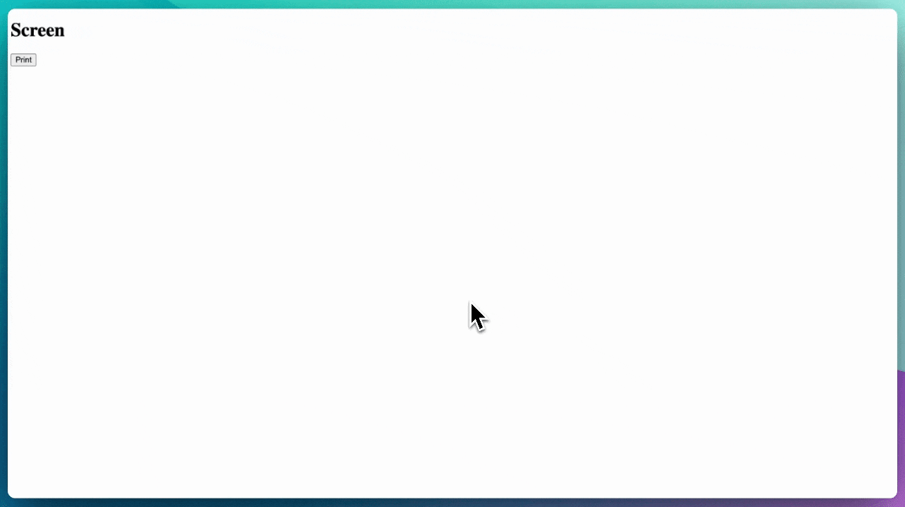

# usePrint() for React

This is a simple react hook that lets you detect print and conditionally render components based on @media print.

<centre>

</centre>

## Installation

```bash
npm install react-use-print

# or

yarn add react-use-print
```

## Usage

```jsx
import { usePrint } from "react-use-print";

export default function App() {
  const { isPrint, print } = usePrint();

  function printNow() {
    print();
  }

  return (
    <div>
      {isPrint ? <h1>Print</h1> : <h1>Screen</h1>}

      <button onClick={printNow}>Print</button>
    </div>
  );
}
```

## Useful links

- https://github.com/facebook/react/issues/11876
